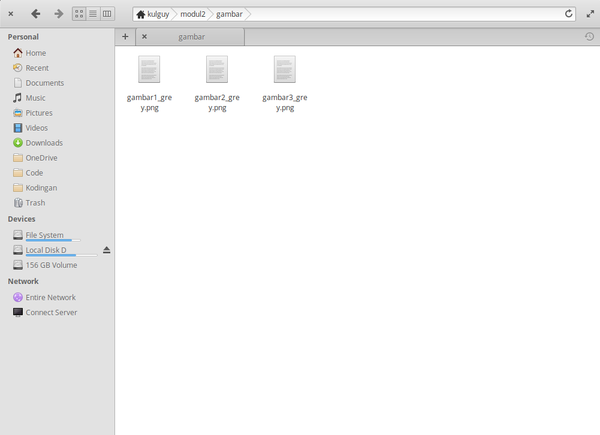
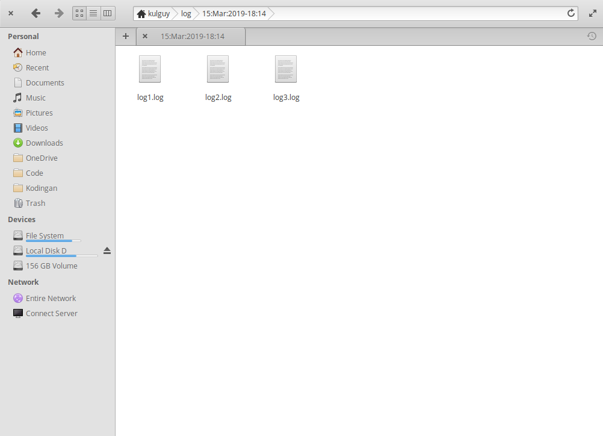

# Soal Shift Modul 2 (Kelompok E6)

###### Nama Anggota :
1. Ifta Jihan Nabila (05111740000034)
2. Komang Yogananda MW (05111740000114)

**Penjelasan Soal Shift Modul 2 Sistem Operasi 2019:**
* [Soal 1](#Soal-1)
* [Soal 2](#Soal-2)
* [Soal 3](#Soal-3)
* [Soal 4](#Soal-4)
* [Soal 5](#Soal-5)

## Soal 1
Elen mempunyai pekerjaan pada studio sebagai fotografer. Suatu hari ada seorang klien yang bernama Kusuma yang meminta untuk mengubah nama file yang memiliki ekstensi .png menjadi “[namafile]_grey.png”. Karena jumlah file yang diberikan Kusuma tidak manusiawi, maka Elen meminta bantuan kalian untuk membuat suatu program C yang dapat mengubah nama secara otomatis dan diletakkan pada direktori /home/[user]/modul2/gambar.

Catatan : Tidak boleh menggunakan crontab.

**_Jawaban:_**  
Menggunakan library tambahan yaitu `<dirent.h>` untuk membantu membaca directory pada program c.
```c
DIR *gambar;
struct dirent *entry;
gambar = opendir(".");
```
- Variable **gambar** merupakan directory yang akan dibaca. Fungsi `opendir(".")` dilakukan untuk membaca file pada directory tempat program tersebut active. 
- Variable **entry** menyimpan informasi dari file yang dibaca pada directory seperti nama dll.

```c
while(entry = readdir(gambar)){
    int len = strlen(entry->d_name);
    char *s = &entry->d_name[len - 4];
    char *namafile;
    if (strcmp(s, ".png") == 0 && entry->d_type == DT_REG){
        memcpy(namafile, entry->d_name, strlen(entry->d_name) - 4);
        char *grey = malloc(strlen("_grey") + strlen(entry->d_name) + 1 + strlen("/home/kulguy/modul2/gambar/"));
        strcpy(grey, "/home/kulguy/modul2/gambar/");
        strcat(grey, namafile);
        strcat(grey, "_grey.png");
        puts(grey);
        puts(entry->d_name);
        rename(entry->d_name, grey);
    }
}
```
- Fungsi `readdir(gambar)` digunakan untuk membaca sebuah file pada directory **gambar** dan kemudian informasinya dimasukkan kedalam variable **entry**.
- `while(entry = readdir(gambar))` berfungsi untuk membaca semua file selama masih ada file yang belum terbaca.
-  Untuk membaca namafile pada `struct dirent` dapat dengan mengakses attribute `struct dirent d_name`.
- Variable **s** menyimpan nilai extension dari suatu file.
- `malloc` digunakan untuk meminta memory.
- Variable **namafile** digunakan untuk menyimpan namafile tanpa extension. Didapat dengan cara mengcopy isi dari **entry->d_name** sebanyak panjangnya dipotong 4 (jumlah panjang ekstensi).
- ``` 
  strcpy(grey, "/home/kulguy/modul2/gambar/");
  strcat(grey, namafile);
  strcat(grey, "_grey.png");
  ```
  fungsi - fungsi tersebut digunakan untuk mengubah nama file menjadi namafile_grey.png dan sesuai dengan directory tujuan.
- Fungsi `rename(entry->d_name, grey)` digunakan untuk memindahkan file dengan nama **entry->d_name** pada directory aktif menjadi file bernama **grey** hasil olahan terdahulu.
- `if (strcmp(s, ".png") == 0 && entry->d_type == DT_REG)` digunakan untuk mendeteksi file yang memiliki nama berakhiran png dan merupakan file regular (bukan directory).

**Hasil**  
  Awal
  
  
  Setelah dijalankan
  
  
  
## Soal 2
Pada suatu hari Kusuma dicampakkan oleh Elen karena Elen dimenangkan oleh orang lain. Semua kenangan tentang Elen berada pada file bernama “elen.ku” pada direktori “hatiku”. Karena sedih berkepanjangan, tugas kalian sebagai teman Kusuma adalah membantunya untuk menghapus semua kenangan tentang Elen dengan membuat program C yang bisa mendeteksi owner dan group dan menghapus file “elen.ku” setiap 3 detik dengan syarat ketika owner dan grupnya menjadi “www-data”. Ternyata kamu memiliki kendala karena permission pada file “elen.ku”. Jadi, ubahlah permissionnya menjadi 777. Setelah kenangan tentang Elen terhapus, maka Kusuma bisa move on.

Catatan: Tidak boleh menggunakan crontab

**_Jawaban:_**

Menggunakan `<sys/stat.h>` header yang digunakan oleh **stat()** untuk mendapatkan informasi dari atribut pada structure.

```c
struct stat info;
stat("/home/jihan/hatiku/elen.ku", &info);
struct passwd *pwd = getpwuid(info.st_uid);
struct group  *grp = getgrgid(info.st_gid);
```

 - memanggil fungsi stat untuk menyimpan seluruh informasi pada file **elen.ku** yang disimpan pada atribut **info**
 - membuat variabel **pwd** **grp** untuk menyimpan informasi user dan group pada file
 - `st_uid` untuk mendapatkan user ID dari file
 - `st_gid` untuk mendapatkan group ID dari file
 
```c
if ( strcmp(pwd->pw_name, "www-data") == 0 && strcmp(grp->gr_name, "www-data") == 0)
{
  pid_t child = fork();
  int status = 0;
  if (child == 0)
  {
    char *argv[4] = {"chmod", "777", "/home/jihan/hatiku/elen.ku", NULL};
    execv("/bin/chmod", argv);
  }
  else
  {
        while((wait(&status)) > 0);
        remove("/home/jihan/hatiku/elen.ku");
  }
}
 ```
 
File **elen.ku** akan dihapus apabila owner dan group file tersebut yaitu "www-data", namun sebelum dihapus ubah permission pada file **elen.ku** menjadi **777**.

 - Pertama cek apakah owner dan group file pada file **elen.ku** adalah "www-data" dengan sintaks 
 ```c
 if ( strcmp(pwd->pw_name, "www-data") == 0 && strcmp(grp->gr_name, "www-data") == 0)
 ```
 - Gunakan **fork()**, jalankan child untuk mengganti file permission menjadi **777** menggunakan command **chmod**. Berikut ini sintaksnya
```c
char *argv[4] = {"chmod", "777", "/home/jihan/hatiku/elen.ku", NULL};
execv("/bin/chmod", argv);
```
 - Setelah child telah dieksekusi, maka parent akan menjalankan perintah untuk menghapus file **elen.ku**
 ```c
 while((wait(&status)) > 0);
 remove("/home/jihan/hatiku/elen.ku");
 ```
 
Untuk menjalankan program c tersebut **setiap 3 detik** maka gunakan **_daemon_** dan gunakan perintah `sleep(3)` untuk menjalankannya setiap 3 detik.

**Hasil**

Awal


Setelah dijalankan


File elen.ku terhapus


## Soal 3
Diberikan file campur2.zip. Di dalam file tersebut terdapat folder “campur2”. 
Buatlah program C yang dapat :

i)  mengekstrak file zip tersebut.

ii) menyimpan daftar file dari folder “campur2” yang memiliki ekstensi .txt ke dalam file daftar.txt. 

Catatan:  

 - Gunakan fork dan exec.

 - Gunakan minimal 3 proses yang diakhiri dengan exec.

 - Gunakan pipe

 - Pastikan file daftar.txt dapat diakses dari text editor

 **_Jawaban:_**   
 Dengan menggunakan 3 buah child process dan 4 buah exec yang masing masing untuk (unzip, ls, grep, dan xdg-open).   
 Child ketiga digunakan untuk melakukan unzip file campur2.zip
 ```c
 char *argv[3] = {"unzip", "campur2.zip", NULL};
 execv("/usr/bin/unzip", argv);
 ```
 Child kedua digunakan untuk melakukan `ls` pada direktori `campur2/` hasil extract data.
 ```c
 while((wait(&status)) > 0);
dup2(pipp[1], STDOUT_FILENO);
close(pipp[0]);
char *argv2[3] = {"ls", "campur2/", NULL};
execv("/bin/ls", argv2);
 ```
 - Potongan program `while((wait(&status)) > 0)` digunakan untuk menunggu child 3 agar selesai melakukan extract file terlebih dahulu.
 - Fungsi `dup2(pipp[1], STDOUT_FILENO)` digunakan untuk menduplikasi `STDOUT_FILENO` kedalam `pipp[1]`. Variable **pipp** merupakan sebauh variable yang digunakan oleh pipe untuk berkomunikasi antara child 2 dengan parentnya (child 1). Indeks 1 pada variable **pipp** menandakan write end.
 - Fungsi `close(pipp[0])` digunakan untuk menutup read end pada pipe karena pada proses ini tidak menggunakan **pipp[0]**.
 - Eksekusi ls dengan argumen directory campur2/. **pipp[1]** akan otomatis berisi keluaran dari `execv` tersebut karena **pipp[1]** merupakan duplikasi dari `STDOUT_FILENO`.

 Child pertama digunakan untuk mengeksekusi `grep`.
```c
while((wait(&status)) > 0);
dup2(pipp[0], STDIN_FILENO);
dup2(pipp_2[1], STDOUT_FILENO);
close(pipp[1]);
close(pipp_2[0]);
char *argv2[3] = {"grep", ".*.txt$", NULL};
execv("/bin/grep", argv2);
```
- Potongan program `while((wait(&status)) > 0)` digunakan untuk menunggu child 2 agar selesai melakukan extract file terlebih dahulu.
- Fungsi `dup2(pipp[0], STDIN_FILENO)` digunakan untuk menduplikasi `STDIN_FILENO` ke variable **pipp[0]** (read end) dari pipp awal.
- Fungsi `dup2(pipp_2[1], STDOUT_FILENO)` digunakan untuk menduplikasi `STDOUT_FILENO` ke variable **pipp_2**. Karena `grep` akan mengeluarkan sesuatu pada `STDOUT_FILENO` dan hasil dari grep harus dikomunikasikan dengan parent prosesnya maka variable **pipp_2** merupakan variable yang digunakan oleh pipe untuk mengkomunikasikan child 2 dengan parentnya.
- ```c
  close(pipp[1]);
  close(pipp_2[0]);
  ```
  Karena child 2 tidak menggunakan write end dari **pipp[1]** dan read end dari **pipp_2[0]** maka kedua ujung pipe tersebut ditutup.

- Kemudian eksekusi `grep` dan pilah file yang memiliki ekstensi .txt dengan menggunakan regex `.txt&`.

Pada parent proses
```c
while((wait(&status)) > 0);
char buff[100000];
close(pipp_2[1]);
close(pipp[0]);
close(pipp[1]);
FILE *daftar = fopen("daftar.txt", "w");
read(pipp_2[0], buff, 100000);
fputs(buff, daftar);
fclose(daftar);
char *argv[3] = {"xdg-open", "daftar.txt", NULL};
execv("/usr/bin/xdg-open", argv);
```
- Potongan program `while((wait(&status)) > 0)` digunakan untuk menunggu child 2 agar selesai melakukan extract file terlebih dahulu.
- ```c
  close(pipp_2[1]);
  close(pipp[0]);
  close(pipp[1]);
  ```
  Karena pada proses ini hanya membutuhkan read end dari **pipp_2** maka selain itu ditutup.
- `FILE *daftar = fopen("daftar.txt", "w")` digunakan untuk membuka file `daftar.txt` namun jika tidak ada akan membuat file `daftar.txt` tersebut.
- `read(pipp_2[0], buff, 100000)` digunakan untuk membaca **pipp_2[0]** dan menyimpannya dalam variable **buff**.
- ```c
  fputs(buff, daftar);
  fclose(daftar);
  ```
  Kemudian hasil dari `read` tersebut ditulis pada file daftar yang sudah dibuka tadi. Setelah menulis file tersebut maka tutup file daftar tersebut.
- Terakhir eksekusi `xdg-open` untuk memastikan apakah file `daftar.txt` dapat dibuka menggunakan text editor atau tidak.

**Hasil**  
  Hasil
  
  

## Soal 4
Dalam direktori /home/[user]/Documents/makanan terdapat file makan_enak.txt yang berisikan daftar makanan terkenal di Surabaya. Elen sedang melakukan diet dan seringkali tergiur untuk membaca isi makan_enak.txt karena ngidam makanan enak. Sebagai teman yang baik, Anda membantu Elen dengan membuat program C yang berjalan setiap 5 detik untuk memeriksa apakah file makan_enak.txt pernah dibuka setidaknya 30 detik yang lalu (rentang 0 - 30 detik).
Jika file itu pernah dibuka, program Anda akan membuat 1 file makan_sehat#.txt di direktori /home/[user]/Documents/makanan dengan '#' berisi bilangan bulat dari 1 sampai tak hingga untuk mengingatkan Elen agar berdiet.

Contoh:
File makan_enak.txt terakhir dibuka pada detik ke-1

Pada detik ke-10 terdapat file makan_sehat1.txt dan makan_sehat2.txt

Catatan: 

 - dilarang menggunakan crontab
 
 - Contoh nama file : makan_sehat1.txt, makan_sehat2.txt, dst

**_Jawaban:_**

Terdapat file **makan_enak.txt** pada direktori /home/[user]/Documents/makanan, apabila file **makan_enak.txt** tersebut pernah dibuka antara _rentang waktu 0-30 detik_, maka program C akan membuat 1 file dengan nama **makan_sehat#.txt** setiap _5 detik_ .

Menggunakan `<sys/stat.h>` header yang digunakan oleh **stat()** untuk mendapatkan informasi dari atribut pada structure.

Menggunakan `<time.h>` header agar dapat memanggil fungsi **difftime()**.

```c
struct stat makan;
stat("/home/jihan/Documents/makanan/makan_enak.txt", &makan);
time_t waktu_file = makan.st_atime;
time_t waktu_now = time(NULL);
```
 - memanggil fungsi stat untuk menyimpan seluruh informasi pada file **makan_enak.txt** yang disimpan pada atribut **makan**
 - membuat variabel **waktu_file** dan **waktu_now** untuk menyimpan informasi waktu terakhir file **makan_enak.txt** diakses dan current time.
 - `waktu_file = makan.st_atime;` untuk mendapatkan waktu terakhir file **makan_enak.txt** telah dibuka
 - `waktu_now = time(NULL);` untuk mendapatkan waktu sekarang pada server
 
```c
double rangew = difftime(waktu_now, waktu_file);
```
 - memanggil fungsi **difftime()** untuk menghitung perbedaan waktu antara waktu sekarang pada server dan waktu terakhir file **makan_enak.txt** telah dibuka (waktu_now - waktu_file). Lalu disimpan pada variabel **rangew**.

```c
if(rangew >= 0 && rangew <= 30)
	{
		pid_t child = fork();
		int status = 0;
		char namafile[20];
                chdir("/home/jihan/Documents/makanan");
		if (child == 0){
		 sprintf(namafile, "makan_sehat%d.txt", counter);
		 char *argv[3] = {"touch", namafile, NULL};
		 execv("/usr/bin/touch", argv);
		}
		else {
		 while((wait(&status)) > 0);
		 counter++;
		}
	}
```
 - Cek apakah **rangew** terdapat pada interval _0-30 detik_. Apabila iya, maka file **makan_enak.txt** telah dibuka antara rentang waktu 0-30 detik (waktu_file) yang lalu dari current time (waktu_now)
 - Gunakan **fork()**, jalankan child untuk membuat file **makan_sehat#.txt**
 - Sebelumnya telah diinisialisasi `int counter = 1;` sebelum loop. Karena file yang akan dibuat pertama yaitu **makan_sehat1.txt**
 - Child akan membuat file dengan command **touch** 
   ```c
   if (child == 0){
		 sprintf(namafile, "makan_sehat%d.txt", counter);
		 char *argv[3] = {"touch", namafile, NULL};
		 execv("/usr/bin/touch", argv);
		}
   ```
 - Setelah child dieksekusi, maka akan mengeksekusi parent yang akan increment variabel **counter**.
   ```c
   else {
		 while((wait(&status)) > 0);
		 counter++;
		}
   ```

Untuk menjalankan program c tersebut **setiap 5 detik** maka gunakan **_daemon_** dan gunakan perintah `sleep(5)` untuk menjalankannya setiap 5 detik.

**Hasil**

Pada direktori makanan hanya terdapat file makan_enak.txt


File makan_enak.txt dibuka


Setelah dibuka maka terdapat beberapa file makan_sehat#.txt


## Soal 5
Kerjakan poin a dan b di bawah:

 a. Buatlah program c untuk mencatat log setiap menit dari file log pada syslog ke /home/[user]/log/[dd:MM:yyyy-hh:mm]/log#.log

Ket:

 - Per 30 menit membuat folder /[dd:MM:yyyy-hh:mm]

 - Per menit memasukkan log#.log ke dalam folder tersebut

   ‘#’ : increment per menit. Mulai dari 1

  b. Buatlah program c untuk menghentikan program di atas.

NB: Dilarang menggunakan crontab dan tidak memakai argumen ketika menjalankan program.

**_Jawaban A:_**   
Menggunakan library tambahan `<time.h>` untuk membantu mengakses waktu dalam program c.
```c
int counter = 0;
char namafolder[20];
```
- Variable **counter** diinisialisasi dengan nilai 0.
```c
pid_t child;
int status = 0;
child = fork();
```
- Membuat sebuah child process untuk melaksanakan salah satu antara `mkdir` ataupun `cp`.

```
counter %= 30;
```
Setiap 30 menit, nama file kembali lagi ke 1.

Terdapat 2 kondisi yaitu apabila menit awal maka child process digunakan untuk membuat folder.  
Kondisi pertama
```c
if (counter == 0){
    time_t rawtime;
    struct tm * timeinfo;  
    time(&rawtime);
    timeinfo = localtime(&rawtime);
    strftime(namafolder, 20, "%d:%b:%Y-%H:%M", timeinfo);
    if (child == 0){
        char *argv[4] = {"mkdir", "-p", namafolder, NULL};
        execv("/bin/mkdir", argv);
    }
    else{
        while((wait(&status)) > 0);
    }
}
```
- **time_t** merupakan variable untuk menyimpan data waktu. Kemudian data waktu dipetakan dalam localtime.
- Fungsi `strftime(namafolder, 20, "%d:%b:%Y-%H:%M", timeinfo)` digunakan untuk memetakan waktu sesuai dengan format yang diminta untuk nama folder. Hasil tersebut kemudian disimpan dalam variable **namafolder**.
- Kemudian buat folder berdasarkan nama tersebut.
- Untuk parent processnya melanjutkan ke operasi selanjutnya.
Kondisi kedua
```c
else{
    char namafile[20];
    chdir(namafolder);
    if (child == 0){
        sprintf(namafile, "log%d.log",counter);
        char *argv[4] = {"cp", "/var/log/syslog", namafile, NULL};
        execv("/bin/cp", argv);
    }
    else{
        while((wait(&status)) > 0);
    }
    chdir("..");
}
```
- Fungsi `sprintf(namafile, "log%d.log",counter);` digunakan untuk membuat nama file sesuai format dan memasukkannya kedalam variable **namafile**.
- Kemudian eksekusi `cp` syslog dengan mengubah namanya menjadi namafile baru hasil proses terdahulu.
- Sebelum copy file fungsi `chdir(namafolder)` dipanggil terlebih dahulu agar dicopy ke folder yang sudah dibuat. Setelah sukses tercopy `chdir("..")` dipanggil untuk mengembalikan directory ke tempat asal.
```c
sleep(60);
counter++;
```
Kemudian diakhir setiap process, daemon dihentikan selama 1 menit dan counter ditambah untuk menyatakan menitnya bertambah.

**Hasil A**   
  Hasil Folder
  
  
  
  File permenit
  
  

**_Jawaban B:_** 
```c
char *argv[3] = {"pkill", "soal5a", NULL};
execv("/usr/bin/pkill", argv);
```
- Dengan menggunakan `execv` untuk mengeksekusi command `pkill`.
- Command `pkill` adalah sebuah command untuk melakukan kill pada proses yang memiliki nama sesuai argument.

**Hasil B**  
  Proses daemon sedang berjalan 
  
    
  
  Ketika `soal5b` dieksekusi  
  
  
